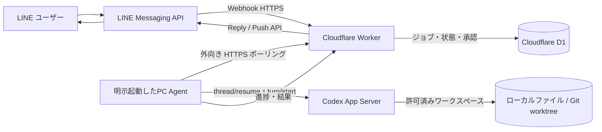
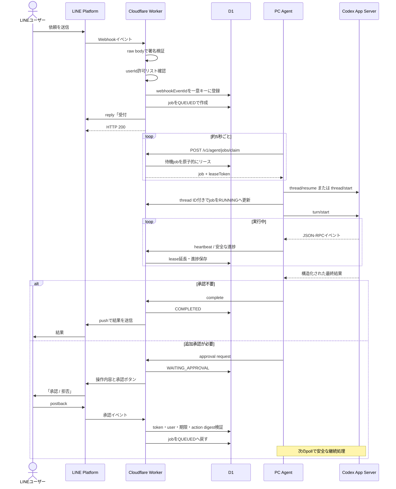
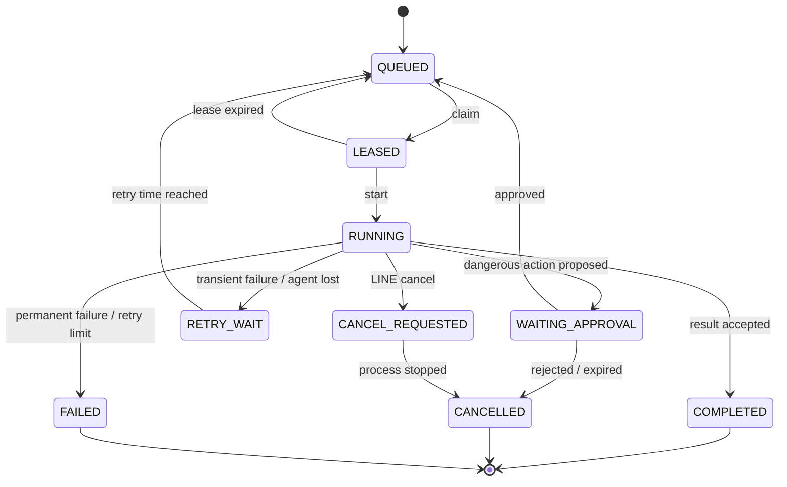

# LINE × Cloudflare × PC Codex 秘書アプリ設計

> Windowsネイティブの導入・起動は[Windows手順](windows-setup.md)を併用してください。Windowsでは`npm.cmd`、秘密入力は対話TTY、PC鍵はDPAPI CurrentUserを使います。以下のmacOSクリップボード・GUI・Keychain操作はMac専用です。公開0.3.0は個人トークの文字・画像・動画に対応。Codexは読み取り専用、Agentは添付保存とコピー整理を行います。[現行の機能](media-support.md)と[更新手順](upgrade-0.3.0.md)を参照し、以下の旧テキスト版の動作説明より優先してください。既存環境の具体的なIDやURLは新規導入へ転用しないでください。


更新日: 2026-09-03

## 1. 結論

MVP は次の構成にする。



中心となる設計判断は以下。

- PC には受信用ポートを開けない。利用者が明示起動したPC Agentが、起動中だけCloudflare Workerを5秒間隔でポーリングする。
- D1をジョブの正本にする。PCが数日オフラインでも依頼を保持できる。
- Codexデスクトップ画面は自動操作しない。PC AgentがCodex App Serverを前景の子プロセスとして1つ起動し、LINEトークごとに同じCodexスレッドへターンを追加する。
- 初回構築は[AIセットアップ・ナビゲーター](./setup-navigator.md)がLINE公式アカウント作成から疎通確認までA〜Zで案内し、各段階を自動検証する。
- 初心者向け体験は[「中学生にもわかる」プロダクト方針](./product-principles.md)を受入基準にする。ターミナル操作は秘書を開始する1コマンドに絞る。
- 公開0.3.0は個人LINEアカウント1名、PC1台、同時実行1件、文字・画像・動画に対応する。
- CodexにOS全体の権限を渡さない。読み取りと隔離worktree内の変更を中心にし、外部送信、削除、mainへの反映などはLINE上で個別承認する。
- LINEのチャネルアクセストークンとシークレットはWorkerだけが保持する。PCやCodexへ渡さない。

「ローカルCodex」は、Codex CLIとコマンド実行がPC上で動くという意味である。通常のCodex認証を使う場合、推論に必要なプロンプトや選択されたファイル内容はOpenAIへ送信される。完全なローカル推論が必要なら、別要件としてOllamaまたはLM Studioを使う構成を検討する。

## 2. ChatGPT Proへの相談結果と補正

ChatGPT Proには、LINE Bot、Cloudflare、自宅PCのCodexを結ぶ個人秘書アプリとして、セキュリティ、障害処理、権限制御、実装順まで含む設計を依頼した。Proが示したMVPの方針は **Worker + D1 + PC側の外向きポーリング** であり、Queues、Durable Objects、Tunnelは必要になってから追加するというものだった。

2026年現在、Cloudflare Queuesには外部PCがHTTPで取得できるPull Consumerがある。しかし、今回のMVPでは採用しない。

| 方式 | 長所 | 短所 | 判断 |
|---|---|---|---|
| Worker + D1ポーリング | 永続状態とジョブを1か所に置ける。専用Queue権限をPCへ渡さない。長期間オフラインにも対応しやすい | リース、再試行、重複排除を実装する必要がある | **MVPで採用** |
| Cloudflare Queues Pull Consumer | 外部PCからHTTPでpull/ackでき、可視性タイムアウトと再試行が組み込み | Freeは保持24時間。PCにQueues read/write API tokenが必要。D1は承認・状態管理用に結局必要 | 利用量増加時に検討 |
| Durable Objects + WebSocket | 低遅延で双方向の進捗通知が可能 | 再接続、状態同期、課金、実装が増える | 複数PCや即時性が必要になったら追加 |
| Cloudflare Tunnel | PCから外向き接続でトンネルを張れる | Cloudflare側からPCサービスへ到達可能な経路を作るため、今回のpull-only設計には不要 | 管理画面やデバッグ用途に限定 |

## 3. 処理シーケンス



Webhookでは、D1への永続化が成功してから受付返信を行う。D1書き込みに失敗した場合は2xxを返さず、LINEの再送対象にする。受付返信に失敗しても、ジョブ自体が保存済みなら最終結果はPush APIで送れる。

## 4. Cloudflare側

### Workerの責務

- LINE Webhookの署名検証とイベントの重複排除
- 許可ユーザー、メッセージ種別、本文サイズの検証
- ジョブ作成、取得、リース、再試行、キャンセル、承認、完了のAPI
- LINE Reply APIとPush APIの呼び出し
- レート制限と監査ログ
- 期限切れリース、承認待ち、古い本文の掃除

WorkerはCodexやPCのファイルへ直接アクセスしない。LINE向けエンドポイントは公開するが、`/v1/agent/*` はPC専用認証を必須にする。

### API

| Method | Path | 呼び出し元 | 用途 |
|---|---|---|---|
| `POST` | `/v1/line/webhook` | LINE | Webhook受信 |
| `POST` | `/v1/agent/jobs/claim` | PC | 次のジョブを原子的に取得 |
| `POST` | `/v1/agent/jobs/:id/start` | PC | 実行開始を記録 |
| `POST` | `/v1/agent/jobs/:id/heartbeat` | PC | リース延長、キャンセル確認、進捗更新 |
| `POST` | `/v1/agent/jobs/:id/approval` | PC | 追加承認要求を登録 |
| `POST` | `/v1/agent/jobs/:id/complete` | PC | 正常終了と結果登録 |
| `POST` | `/v1/agent/jobs/:id/fail` | PC | 失敗または再試行可能エラーを登録 |
| `GET` | `/v1/agent/health` | PC | 時刻ずれ、接続、バージョン確認 |

`claim` は1回の条件付きUPDATEで、次の対象を `LEASED` にし、ランダムなリーストークンと期限を返す。他のPCまたは再送された呼び出しが同じジョブを同時取得できないようにする。以降の更新は `job_id + lease_token + 現在状態` が一致したときだけ成功させる。

### D1データモデル

```text
line_events
  webhook_event_id PK
  user_id
  event_type
  received_at

jobs
  id PK (ULID)
  webhook_event_id UNIQUE
  user_id
  conversation_key
  workspace_key
  prompt
  requested_mode
  status
  attempt_count
  lease_token_hash
  lease_expires_at
  codex_thread_id
  cancel_requested_at
  error_code
  created_at / started_at / completed_at / updated_at

job_events
  id PK
  job_id
  kind
  public_message
  idempotency_key UNIQUE
  created_at

approvals
  id PK
  job_id
  user_id
  action_type
  action_digest
  summary
  token_hash
  status
  expires_at
  decided_at

audit_events
  id PK
  actor
  action
  job_id
  metadata_json
  created_at
```

`jobs(status, created_at)`、`jobs(conversation_key, status)`、`jobs(lease_expires_at)` にインデックスを付ける。プロンプトと結果は7日後に消し、監査ログは本文やシークレットを含めず30日程度保持する。

### 状態遷移



同じ `conversation_key + workspace_key` は同時実行しない。会話の順序とCodexセッションの整合性を保つためである。

## 5. LINE側

### 受信

1. `request.text()` でraw bodyを一度だけ読む。
2. `LINE_CHANNEL_SECRET` を鍵にHMAC-SHA256を計算し、Base64化して `x-line-signature` と定数時間比較する。
3. `source.userId` が `ALLOWED_LINE_USER_IDS` に含まれないイベントは、内容を保存せず200で終了する。
4. `webhookEventId` の一意制約で再送を重複排除する。
5. 公開0.3.0では個人チャットの文字・画像・動画を受け付ける。グループは処理せず、音声・一般ファイルは未対応と案内する。

### コマンド

- 通常テキスト: 新規依頼
- `状態` または `状態 J123`: 実行状況
- `キャンセル J123`: キャンセル要求
- `ヘルプ`: 利用可能な機能とワークスペース名
- 承認と拒否: テキストの「はい」ではなく、署名付きpostbackボタンだけを使う

受付では「PC Codexへ送信したこと、受付番号、実行モード」を返す。PC Agentが取得したら受信・処理中を通知し、最後に結果と同じ受付番号を返す。進捗通知は開始、承認待ち、完了、失敗に絞り、Codexの内部推論や生のコマンド出力は送らない。

## 6. PC Agent

TypeScript + Node.jsで作り、利用者がターミナルで `npm run secretary` を実行している間だけ動かす。OSの自動起動サービスには登録しない。起動状態とCodex App Serverの接続・開始・完了を同じターミナルに表示し、`Ctrl+C`で停止する。ローカルSQLiteには、Codexのthread ID、実行中プロセス、ジョブごとの成果物パスだけを保存する。

LINE秘書のモデル規定は `gpt-5.6-luna`、推論強度は `max` とする。PC上の既定モデルに依存させず、`thread/start` と `thread/resume` でモデルを、`turn/start` でモデルと推論強度を毎回指定する。この規定はLINE秘書のApp Serverセッションだけに適用し、Codex Appの通常タスクには影響させない。

### ポーリング

- 通常は5秒間隔。ネットワーク障害時は指数バックオフし、最大60秒にする。
- 同時実行は1件。将来増やす場合も、会話単位のロックを維持する。
- 取得後の初期リースは45分。30秒ごとのheartbeatで延長する。
- Codex子プロセスの標準タイムアウトは30分。キャンセル時はTERM、猶予後にKILLする。
- PC再起動後に利用者が再び起動したときは、ローカルの実行記録とD1を照合し、期限切れジョブを再取得する。

### ワークスペース

LINEから絶対パスを指定させない。PC側の設定ファイルだけに次のような対応を持つ。

```yaml
workspaces:
  linebot:
    path: /Users/hgs/Documents/ChatGPT/LineBotV2
    mode: git
    allow_write: true
  documents:
    path: /Users/hgs/Documents
    mode: read_only
    allow_write: false
```

Workerが渡すのは `workspace_key` だけである。PC側で未登録キー、symlinkによる外部脱出、許可ルート外のパスを拒否する。

### Codexセッションへの接続

`npm run secretary` は `codex app-server --stdio` を1つだけ起動する。最初のLINE依頼ではスレッドを作り、以後はローカルSQLiteに保存したスレッドIDを使って同じ会話を続ける。

```text
initialize → initialized
thread/start → thread IDを保存
turn/start → 構造化結果を受信

次の依頼:
thread/resume → 保存したthread ID
turn/start → 同じ文脈へ追加
```

- `thread/start` と `thread/resume` は `read-only`、approval `never`、固定workspaceで実行する。
- `turn/start` はネットワークなしの読み取り専用sandboxと結果JSON Schemaを毎回指定する。
- `item/completed` から最終メッセージを受け取り、`turn/completed` で完了を確定する。
- `Ctrl+C`、LINEキャンセル、timeoutでは `turn/interrupt` を送り、応答しなければApp Serverを終了する。
- App Serverは現行Codex CLIでExperimentalであるため、CLI更新時にsmoke testと生成schemaの互換性を確認する。

変更ジョブを追加するときは、ジョブ専用Git worktreeと `workspaceWrite` sandboxを使う。MVPは読み取り専用に固定する。

既存のCodex CLI認証はPC内に置いたままにする。OpenAI APIキーを採用する場合も、キーはCodexプロセスの起動時環境にだけ渡し、Worker、D1、LINE、ログへ送らない。

### Codex Appとの関係

この方式は、[OpenAI公式のCodex App Server](https://learn.chatgpt.com/docs/app-server)を使う。既存のCodexデスクトップ画面をクリックしてLINEジョブを投入する仕組みではない。LINE用に作ったCodexスレッドは永続保存し、PC Agent再起動後に `thread/resume` で再接続する。

stdio接続なのでPCに受信用ポートは開かない。App ServerはPC Agentの子プロセスであり、`Ctrl+C`で一緒に停止する。

したがってMVPの判断は次のとおり。

| 用途 | 採用するもの |
|---|---|
| 初回セットアップ、進捗確認、人によるレビュー | Codex App |
| LINEから届いた読み取りジョブの実行 | PC Agentが管理するCodex App Serverの同一スレッド |
| 将来、書き込み承認が必要になった場合 | App Serverのapproval requestをLINEの署名付きpostbackへ対応付け |

利用者は秘書を使い始めるときに `npm run secretary` を実行する。PC AgentとCodexセッションサーバーはそのターミナルが開いている間だけ動く。ターミナルには、時刻、LINE本文の短いプレビュー、受付番号、セッション接続、処理中、返信文の短いプレビュー、処理時間を表示し、LINEからPCへ依頼が届く流れを視覚化する。

## 7. 権限制御とLINE承認

| レベル | 例 | MVPの扱い |
|---|---|---|
| L0 読み取り | ファイル一覧、要約、`git diff`、静的解析 | 自動実行。`read-only` sandbox |
| L1 隔離書き込み | 専用worktree内の編集、生成、フォーマット | 依頼文に変更意図が明記されている場合だけ自動。mainへは反映しない |
| L2 制限コマンド | allowlist済みのtest/build/lint | worktree内、ネットワーク不要のものだけ自動 |
| L3 重要変更 | mainへの反映、package install、ネットワークアクセス、git push、ファイル移動・削除 | 操作内容を固定してLINE承認 |
| L4 高影響 | 外部メッセージ送信、権限変更、認証情報操作、課金、公開、復元困難な削除 | MVPでは実行不可。将来は専用ハンドラと直前承認 |

承認では次を表示する。

```text
[承認 A7K2 / Job J123]
操作: branch codex/line-J123 を origin へpush
対象: linebot リポジトリ
差分: 3 files, +84/-12
期限: 10分
[承認する] [拒否]
```

postbackには推測困難なワンタイムトークンを含め、D1にはそのハッシュだけを保存する。Workerは `user_id`、`job_id`、`action_digest`、期限、未使用状態を検証する。承認後もCodexへ広い権限を渡さず、ローカルの専用ハンドラが表示済みの操作だけを実行する。

## 8. セキュリティ

### シークレット

- Worker secrets: `LINE_CHANNEL_SECRET`、`LINE_CHANNEL_ACCESS_TOKEN`、PCエージェントトークンのハッシュ
- macOS Keychain: 256-bitのランダムなPCエージェントトークン
- PC内Codex認証: 既存のCodex管理領域。WorkerやD1へコピーしない
- `.dev.vars` や `.env` はGit管理しない。ログへトークン、Authorizationヘッダー、ユーザーIDを出さない。LINE本文は手元のデモ用ターミナルに短いプレビューだけを表示し、監査ログやクラウドログには複製しない

### PC API認証

MVPはTLS上の256-bit Bearer tokenを使い、Workerでハッシュを定数時間比較する。`claim` が返すリーストークンはジョブごとに一度だけ生成し、D1にはハッシュを保存する。更新APIはリーストークンと現在状態が一致しない限り拒否する。

各状態変更には `Idempotency-Key` を必須にし、D1の一意制約で再送を無害化する。トークンをKeychainに限定し、定期ローテーションを可能にする。複数PC対応時は端末ごとの鍵、失効リスト、HMAC署名またはCloudflare AccessのService Tokenへ拡張する。

### 防御

- Webhook: LINE署名、raw body、user allowlist、イベントID重複排除
- Cloudflare: WAF/Rate Limiting、本文サイズ上限、Content-Type固定
- Agent: workspace allowlist、symlink検査、1ジョブ1worktree、子プロセスの環境変数allowlist
- Codex: 最小sandbox、個人MCP無効化、シークレットのあるパスを追加ディレクトリにしない
- 監査: 誰が、いつ、どのジョブで、どの固定操作を承認したかを記録。プロンプト全文やCodexの内部推論は監査ログへ入れない
- データ: D1の本文は短期保持。資格情報、顧客情報、医療・金融情報をLINEへ送らない

## 9. 障害、重複、長時間処理

| 事象 | 処理 |
|---|---|
| LINEが同じWebhookを再送 | `webhookEventId` の一意制約で同じjobを返す |
| PCがオフライン | D1の `QUEUED` に残る。復帰後のpollで処理 |
| PCが実行中に停止 | leaseとheartbeatが期限切れになった後、最大3回再試行 |
| Codexがタイムアウト | 子プロセスを停止し、タイムアウト要約をLINEへ通知。ユーザー操作で再試行 |
| Workerへの結果送信が失敗 | PCがローカル結果を保持し、同じIdempotency-Keyで再送 |
| 完了直後にPCが落ちる | D1がCOMPLETEDなら再配信ジョブを実行せず、その結果を返す |
| 書き込みジョブが重複 | 同じjob IDのworktreeと完了マーカーを利用。mainへ自動反映しない |
| ユーザーがキャンセル | heartbeat応答で `cancel_requested` を受け、Codexを停止 |
| LINEに収まらない結果 | 4,000文字程度で安全に分割し、冒頭要約を送る。全文はPCにMarkdown保存。R2は後で追加 |
| 結果のLINE送信だけ失敗 | `notification_status` を分離し、結果実行とは別に再送 |

Codexの自由形式出力をそのままLINE APIへ渡さない。エージェントがスキーマ検証、制御文字除去、長さ制限を行う。

## 10. MVPのディレクトリ案

```text
LineBotV2/
  apps/
    worker/             # Cloudflare Worker
      src/
      migrations/
      wrangler.jsonc
    agent/              # 明示起動するPC Agent
      src/
  packages/
    protocol/           # API型、JSON Schema、状態遷移
  docs/
    architecture.md
    setup-navigator.md    # A〜ZのAIセットアップ案内
    product-principles.md # 初心者向けUXと受入基準
    ai-setup-runbook.md   # 実行AIへ渡すライブ手順書
  .github/workflows/
```

WorkerとAgentはTypeScript、入力検証はZod、テストはVitest、Workerローカル実行はWranglerを使う。共有パッケージにはネットワーク用DTOだけを置き、Worker専用シークレット型やローカルパスを混ぜない。

## 11. 1〜2週間の実装順

セットアップ・ナビゲーターは、まず手作業で一度E2Eを成立させた後、その確認済み手順を決定的なステップとして実装する。AIはステップを勝手に完了扱いせず、API・CLI・Webhookによる検証結果を説明する。詳細は[AIセットアップ・ナビゲーター設計](./setup-navigator.md)を参照する。

### 1〜2日目: 骨格

- monorepo、TypeScript、Wrangler、D1 migration、protocol schema
- LINE Developer ConsoleでBotとWebhookを準備
- `/v1/line/webhook` の署名検証、user allowlist、イベント重複テスト

### 3〜4日目: ジョブ台帳

- `jobs`、`job_events`、状態遷移
- 原子的claim、lease、heartbeat、再試行、キャンセル
- mock agentでオフライン復帰と重複実行を確認

### 5〜6日目: PC AgentとCodex

- Keychainからの認証、ポーリング、明示起動と`Ctrl+C`停止
- App ServerのJSON-RPCイベント解析、thread再開、timeout、結果schema
- 読み取り専用ジョブをLINEから完走

### 7〜8日目: 安全な書き込み

- workspace allowlist、job専用Git worktree
- `workspace-write`で変更し、diff要約だけLINEへ返す
- mainへ自動反映しないことを障害テストで確認

### 9〜10日目: 承認と運用

- 承認postback、ワンタイムtoken、期限切れ、拒否
- 監査ログ、本文の期限削除、通知再送
- PC停止、回線切断、Webhook再送、Codex強制終了の通しテスト

最初の受入条件は「自分のLINEから依頼すると、PCがオフラインなら待機し、復帰後にCodexが許可ワークスペースを読み、結果が1回だけLINEへ返る」である。

## 12. 費用の考え方

個人MVPの通信量なら、WorkerとD1は通常Free枠内から開始できる。5秒pollは1日約17,280リクエストである。Queuesを採用した場合、2026年4月時点のFree枠は1日10,000 operations、メッセージ保持は24時間である。

費用確認先は次の3か所。

- Cloudflare Workers / D1の実利用量
- LINE公式アカウントのPushメッセージ通数。受付はreply、完了など必要な通知だけpushにする
- Codexの認証方式。ChatGPTでサインインする場合はアカウントの利用上限、API keyの場合はAPI従量課金

固定の月額見積りはプランと利用量で変わるため、実装時点の各コンソールで確認する。

## 13. MVP後の拡張

1. 一般ファイルや音声の受信（画像・動画の原ファイル保存、代表フレーム解析、コピー整理は0.3.0で実装済み）
2. R2へ暗号化成果物を置き、短時間・一度限りのダウンロードURLを発行
3. Cloudflare Queues Pull Consumerで高負荷・複数PCへ対応。ただしD1を正本として残す
4. Durable Objects/WebSocketで低遅延通知
5. カレンダー、メール、GitHubなどを自由shellではなく専用の権限制御済みコネクタとして追加
6. 完全ローカル推論が必要なら、Codex CLIのOSS providerとローカルモデルを別プロファイルで評価

## 14. 実装前に決める5点

1. 最初に許可するLINE user IDは1名だけでよいか。
2. 許可ワークスペースはこの `LineBotV2` だけで開始するか。
3. 初期MVPを読み取り専用までにするか、隔離worktreeへのコード変更まで含めるか。
4. PCが連続でオフラインになり得る最長期間はどの程度か。
5. 通常のCodexクラウド推論でよいか、完全ローカル推論が必要か。

## 参考資料

- [OpenAI Codex: Non-interactive mode](https://developers.openai.com/codex/non-interactive-mode)
- [OpenAI Codex: Agent approvals and security](https://developers.openai.com/codex/agent-approvals-security)
- [Cloudflare Queues: Pull consumers](https://developers.cloudflare.com/queues/configuration/pull-consumers/)
- [Cloudflare Queues: Pricing](https://developers.cloudflare.com/queues/platform/pricing/)
- [LINE Messaging API: Receiving messages](https://developers.line.biz/en/docs/messaging-api/receiving-messages/)
- [LINE Messaging API: Verify webhook signature](https://developers.line.biz/en/docs/messaging-api/verify-webhook-signature/)
