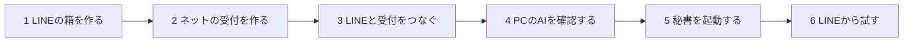

# プロダクト方針: 中学生にもわかるLINE秘書づくり

更新日: 2026-09-03

## 約束する体験

**専門知識がなくても、AIの案内に従うだけで、自分専用のLINE秘書を作れる。**

「中学生でもできる」は利用資格の表現ではなく、説明と操作の分かりやすさを測る基準として使う。実際のアカウント作成では、LINE、Cloudflare、ChatGPTなど各サービスの年齢条件、保護者同意、利用規約に従う。

### コピー案

メイン:

> AIと一緒に、あなた専用のLINE秘書をつくろう。

サブ:

> むずかしい設定はAIが案内。専門知識がなくても、ひとつずつ進められます。

特徴表示:

- ひとつずつ案内
- 設定ミスを自動チェック
- 途中から再開できる
- 大切な操作は実行前に確認

「誰でも必ず作れる」「完全自動」「絶対安全」のように、外部サービスの審査、規約、障害まで保証する表現は使わない。

## 6つの大きなステップ

A〜Zの26項目を最初から並べると難しく見えるため、利用者には6章だけを見せる。詳しい項目は「詳細を見る」で開ける。



| 利用者に見せる章 | 内部の処理 |
|---|---|
| 1. LINEの箱を作る | LINE公式アカウント、Messaging API、Provider、Channel |
| 2. ネットの受付を作る | Cloudflare、D1、Worker、Secret、deploy |
| 3. LINEと受付をつなぐ | Webhook、署名検証、所有者リンク |
| 4. PCのAIを確認する | Codex認証、許可フォルダ、read-onlyテスト |
| 5. 秘書を起動する | PC Agent、Keychain、Codexセッション、明示起動、heartbeat |
| 6. LINEから試す | E2E試験、診断、完了レポート |

## 初心者向けUXの規則

### 1画面1操作

1画面で利用者に頼む本人判断は1つにする。これはクリック数を1回に分解する意味ではない。名前、団体名、業種など合意済みの通常項目は製品側がまとめて入力し、利用者には規約同意、認証、秘密情報の確認など本人しか確定できない場面だけを頼む。「アカウントを作ってProviderを選び、Tokenを発行してください」のように複数の判断はまとめない。

```text
いまやること

「Messaging APIを利用する」を押してください。

これは、LINEのメッセージを秘書へ届けるための設定です。

[この画面を開く]
```

### 主語を明示する

毎回「AIが行うこと」と「あなたが行うこと」を分ける。

```text
AIがすること
✓ 正しいページを開く
✓ 設定できたか確認する

あなたがすること
→ LINEへログインする
```

### 専門用語を翻訳する

専門用語は必要になった瞬間だけ表示し、短い日本語を併記する。

| 用語 | 初回に見せる説明 |
|---|---|
| Webhook | LINEからメッセージが届く入口 |
| Worker | インターネット上の受付係 |
| D1 | 依頼をなくさないためのメモ帳 |
| Channel Secret | 本物のLINEから届いたか確認する合言葉 |
| Access Token | LINEへ返事を送るための鍵 |
| Codex | PC上で調査や作業をするAI |
| Agent | 起動中だけLINEの依頼を同じCodexセッションへ渡すPC上の受付係 |

利用者に `HMAC`、`JSON-RPC`、`lease`、`idempotency` などを設定画面で説明しない。必要な場合は「技術的な詳細」に収納する。

### 選択肢を減らす

初心者モードでは、安全な推奨値を選択済みにする。

- 利用者1名
- 個人チャットのみ
- テキストのみ
- 許可フォルダ1つ
- 読み取り専用から開始
- 同時実行1件
- 外部送信と削除は無効
- Worker + D1

Queues、Durable Objects、Tunnel、R2、App Server、モデル選択などは初回セットアップに表示しない。

### 「完了」ではなく「確認できました」

利用者の自己申告だけで進めない。ナビゲーターがAPI、CLI、Webhookで確認してから、次のように表示する。

```text
接続できました！

✓ LINEからメッセージが届きました
✓ 受付番号が1件だけ作られました
✓ PCの秘書が依頼を受け取りました

[次へ]
```

## エラーの伝え方

エラーコードから始めず、現在地と次の一手から説明する。

悪い例:

```text
Error 401: Invalid channel access token
```

良い例:

```text
LINEへ返事を送るための鍵を確認できませんでした。

入力した鍵が古い可能性があります。
LINEの画面で新しい鍵を表示しましょう。

[LINEの設定を開く] [もう一度確認]
```

「最初からやり直す」を通常の解決方法にしない。該当ステップだけ再試行し、完了済みの設定を残す。

## 安全設計

初心者は権限の意味を判断しにくいため、危険な選択肢を説明だけで許可しない。

- 初回は読み取り専用
- PC全体ではなく、選んだフォルダ1つだけを許可
- `.env`、SSH、Keychain、ブラウザデータへアクセスさせない
- コード変更は専用worktree内だけ
- 削除、公開、送信、課金、権限変更は初期状態で無効
- 起動中のターミナルで `Ctrl+C` を押すとPC Agentを止められる
- LINEで「停止」と送って新しいジョブを受け付けない状態にできる

承認画面では技術名だけでなく、結果を平易に示す。

```text
この操作をすると、3つのファイルが書き換わります。
元に戻せる変更です。

外部への送信や削除はありません。

[変更する] [やめる] [くわしく見る]
```

## 進み具合の表示

```text
セットアップ 3 / 6
████████░░░░ 50%

✓ LINEの箱を作る
✓ ネットの受付を作る
● LINEと受付をつなぐ
○ PCのAIを確認する
○ 秘書を起動する
○ LINEから試す

目安: あと10分
```

時間は確約せず、外部サービスのログイン、本人確認、障害による待ち時間を除いた目安として表示する。

## AIの話し方

- 一文を短くする。
- 最初に「いま行うこと」を言う。
- 一度に3項目を超える箇条書きを見せない。
- 英語のボタン名は、画面上の表記と日本語の意味を併記する。
- 失敗を利用者の責任にしない。
- 「簡単です」と言うだけで説明を省かない。
- 詳細を求められたときだけ技術情報を表示する。

## 初心者モードの完成基準

次を満たしたときだけ「中学生にもわかる設計」と判断する。

- 外部の手順書を開かずに完了できる。
- コピーするIDやURLはナビゲーターが自動入力する。
- Secretのコピーは安全なローカル入力に限定し、最大2回までにする。
- 秘書の開始は `npm run secretary` の1コマンドにまとめ、依頼ごとのコマンドを利用者に入力させない。
- 起動用ターミナルはセットアップ中のCodex Appタスク内に表示し、秘書の状態と停止場所が常に分かるようにする。
- どの画面でも「現在地」「いま行うこと」「次に起きること」が分かる。
- 中断後、1回の操作で続きから再開できる。
- 既存アカウントがある場合、新規作成と既存利用の違いを平易に選べる。
- 代表的な失敗を、エラーコードの検索なしで回復できる。
- 最終試験でLINEから送った依頼に結果が1回だけ返る。
- 初心者テスト参加者の80%以上が、助言者なしで最後まで到達する。

実際の未成年者でユーザーテストを行う場合は、保護者同意、テストデータ、録画、アカウント作成を別途管理する。初期検証は、開発経験のない成人を対象にして読みやすさと迷いにくさを確認できる。

## 最初に作る画面

```text
┌─────────────────────────────────────┐
│ あなた専用のLINE秘書をつくります   │
│                                     │
│ むずかしい設定はAIが案内します     │
│ 作業時間の目安: 約30〜45分          │
│                                     │
│ AIができること                      │
│ ✓ 正しいページを開く               │
│ ✓ 設定ミスを確認する                │
│ ✓ 途中から再開する                  │
│                                     │
│ あなたにお願いすること              │
│ ・LINEとCloudflareへのログイン      │
│ ・利用規約の確認                    │
│                                     │
│ [セットアップを始める]             │
│ [必要なものを見る]                 │
└─────────────────────────────────────┘
```

## プロダクト判断

「中学生でもできる」を達成するには、AIが複雑な構成を詳しく説明するより、複雑さを製品側で引き受ける必要がある。MVPでは技術選択を増やさず、推奨構成を1つに固定し、必要なアカウント操作だけを人に依頼する。
