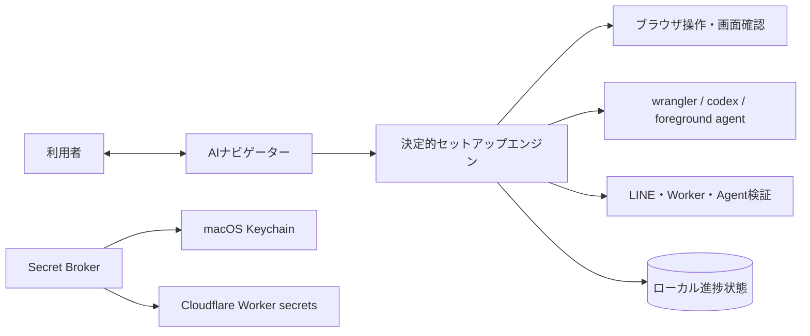
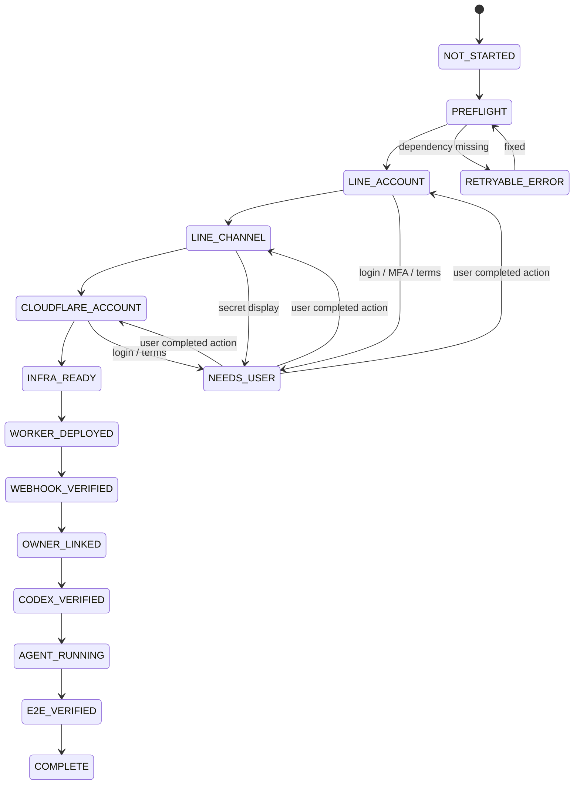

# AIセットアップ・ナビゲーター設計

> Windowsネイティブの導入・起動は[Windows手順](windows-setup.md)を併用してください。Windowsでは`npm.cmd`、秘密入力は対話TTY、PC鍵はDPAPI CurrentUserを使います。以下のmacOSクリップボード・GUI・Keychain操作はMac専用です。公開0.3.0は個人トークの文字・画像・動画に対応。Codexは読み取り専用、Agentは添付保存とコピー整理を行います。[現行の機能](media-support.md)と[更新手順](upgrade-0.3.0.md)を参照し、以下の旧テキスト版の動作説明より優先してください。既存環境の具体的なIDやURLは新規導入へ転用しないでください。


更新日: 2026-09-03

## 1. 目標

利用者が「何を、どの画面で、なぜ行うか」をAIと対話しながら進め、LINE公式アカウント作成からCloudflare、Codex、明示起動するPC Agent、最終疎通確認まで完了できる仕組みにする。

体験品質の基準は「中学生にもわかる」とする。利用者へはA〜Zを6つの章にまとめて見せ、専門用語、ターミナル操作、技術選択をできるだけ製品側で引き受ける。文言、初心者モード、安全設定、ユーザーテストの基準は[プロダクト方針](./product-principles.md)に定める。

単なる長い手順書にはしない。各ステップをプログラムが検出・検証する状態機械にし、AIはその時点の画面と検証結果に応じて説明する。

ナビゲーター自体を信頼の起点にするため、配布物には署名または公開チェックサムを付ける。ブラウザで開けるドメインは `manager.line.biz`、`developers.line.biz`、`dash.cloudflare.com`、対象の `workers.dev` など明示した公式ドメインに限定し、AIが生成した任意URLをそのまま開かない。



AIに全判断を任せるのではなく、次の役割に分ける。

| 部品 | 責務 |
|---|---|
| Setup Engine | ステップ順、前提条件、完了判定、再開、再試行 |
| AI Guide | 目的の説明、現在画面に合わせた案内、エラーの言い換え |
| Browser Adapter | LINEとCloudflareの公式画面を開く、表示を検出する、許可された通常操作を補助する |
| CLI Adapter | Wrangler、D1 migration、Worker deploy、Codex、PC Agentの起動確認を行う |
| Secret Broker | パスワードを表示しない入力、Keychain保存、`wrangler secret put`への受け渡し |
| Verifier | UI上の表示ではなくAPI、HTTP応答、Webhookイベント、プロセス状態で完了を確認する |

各クラウド変更の直前に、現在ログイン中のLINEアカウント、Cloudflare Account ID、環境名 `development | production` を固定表示する。別アカウントや別環境への誤作成を防ぐ。

## 2. 初回と接続後の案内経路

LINE Botが完成する前はLINEから案内できない。このため案内経路を二段階にする。

### Phase 1: Codex内ナビゲーション

- Codexデスクトップの会話を案内役にする。
- サイドパネルのブラウザでLINE Official Account ManagerやCloudflareを開く。
- ターミナルでローカル環境、デプロイ、Codex CLI、PC Agentを検証する。
- ログイン、MFA、規約同意、シークレット表示などは利用者が担当する。

### Phase 2: LINE内ナビゲーション

- Botとの疎通後は「設定状況」「次へ」「再確認」「診断」をLINEから実行できる。
- パスワード、API token、Channel Secretなどの入力はLINE上で受け取らない。
- 秘密情報が必要なステップでは、PC上のローカル画面またはターミナルへ誘導する。

## 3. 利用体験

セットアップ開始コマンドは最終的に次の1つにする。

```bash
npm run setup
```

コマンドはローカルの `http://127.0.0.1:8789/setup` にセットアップ画面を開く。Codex内では同じ状態を読み、次のように案内する。

```text
ステップ E/26: LINE公式アカウントを作成

ここではBotの表示名と利用地域を登録します。
LINE Official Account Managerを開きました。

AIが入力済み:
- アカウント名
- 団体名
- 業種と利用目的

あなたが行うこと:
1. メールアドレスをLINE公式フォームへ直接入力する
2. 入力内容と利用規約を確認する
3. 同意できる場合は「確認」を押す

確認画面が表示されたら「確認画面になった」と送ってください。メールアドレスはこの会話へ貼らないでください。

[画面を開く] [確認する] [既存アカウントを使う] [困っている]
```

「確認する」を押すと、画面の雰囲気だけで完了扱いにせず、次のステップで必要なアカウントまたはAPIの存在を検査する。

## 4. A〜Zのセットアップ

UI変更に耐えるため、ボタンの座標ではなく目的、検出条件、検証条件をステップ定義に持つ。

| ID | ステップ | AIの案内 | 完了の検証 |
|---|---|---|---|
| A | アプリの目的確認 | 何がLINE・Cloudflare・PC・OpenAIへ送られるか説明 | 利用者が構成とデータ経路を確認 |
| B | PC事前診断 | macOS、Node.js、Git、Codex CLI、ブラウザ接続を確認 | 必須コマンドとバージョン検査成功 |
| C | LINE公式画面を開く | `manager.line.biz` を開く | 正規ドメインとログイン画面を確認 |
| D | LINE Business IDでログイン | ログイン方法を説明 | Account Managerへ遷移 |
| E | LINE公式アカウント作成 | 名前、地域、業種の入力場所を案内 | 作成済みアカウントが一覧に存在 |
| F | 基本プロフィール確認 | Bot表示名とアイコンを確認 | 対象アカウントIDをローカル状態へ保存 |
| G | Messaging APIを有効化 | 設定内のMessaging APIを案内 | Messaging APIチャネルが存在 |
| H | Providerを作成・選択 | 個人用Providerの意味を説明 | Provider IDを確認 |
| I | Channel情報確認 | Channel ID、Secret、Access Tokenの用途を説明 | Channel IDを保存、SecretはSecret Brokerへ |
| J | Cloudflareアカウント確認 | 認証済み／アカウントあり・Workers未設定／アカウントなし、の3経路へ案内 | 対象Account IDを確認 |
| K | ローカルプロジェクト準備 | 依存関係と設定ファイルを作成 | package installと設定検証成功 |
| L | Wrangler認証 | 未認証の場合だけ公式ログインを開始 | `wrangler whoami` 成功 |
| M | Cloudflare初期設定・D1作成 | 初回のWorkers規約と公開 `workers.dev` 名を案内し、今回専用D1を作成 | DB ID存在、migration適用済み |
| N | Worker secrets登録 | Secretを非表示入力で登録 | 必須secret名の登録を検証 |
| O | Workerデプロイ | 今回専用Webhook/API Workerをdeploy | 正確なURLの `/healthz` が期待versionを返す |
| P | LINEへWebhook URL登録 | WorkerのWebhook URLを表示しLINE画面を案内 | LINE設定値と期待URLが一致 |
| Q | Webhook検証 | LINEの検証操作を案内 | Workerが署名付き検証リクエストを記録 |
| R | 応答設定整理 | Greetingと自動応答の重複を説明 | Webhook有効、必要な応答設定を確認 |
| S | 所有者LINEを安全に紐付け | PCに10分有効のコードを表示 | `/link 123456` のuserIdをD1へ登録 |
| T | LINE受信テスト | Botを友だち追加してテスト文を送る | D1に重複のないテストjobが作成 |
| U | Codex認証確認 | 既存ログインまたはCodex loginを案内 | App Serverの読み取りテスト成功 |
| V | Codex安全設定確認 | read-only、workspace allowlistを説明 | 許可外パスの拒否テスト成功 |
| W | PC Agent登録 | 端末tokenをKeychainへ保存 | Worker認証と`/health`成功 |
| X | 明示起動 | 現在のCodex Appタスクの統合ターミナルでAgentとCodexセッションを起動する | セッション接続表示とAgent heartbeatを確認 |
| Y | End-to-End試験 | LINEから安全なテスト依頼を送る | 受付、Codex処理、結果返信が1回ずつ成功 |
| Z | 完了レポート | 構成、URL、復旧方法、残課題を表示 | 必須チェックが全てgreen |

### 重要な順序

- WorkerをデプロイしてURLを得てから、LINEへWebhook URLを登録する。
- LINE user IDを手作業でコピーさせず、PCに出した短時間のリンクコードをBotへ送って所有者を登録する。
- Channel SecretとAccess TokenはLINEやAI会話へ貼らせず、PCのSecret Brokerから直接Cloudflareへ登録する。
- Codexの読み取りテストが成功してからPC Agentを明示起動する。OSの自動起動サービスは登録しない。
- 最終試験が成功するまで「完了」にしない。

## 5. 状態機械



各ステップの状態は `pending | active | needs_user | verifying | complete | error | skipped` のいずれかとする。`complete` は `verify()` が成功した場合だけ設定する。

## 6. ステップ定義

ナビゲーターのステップをコードに埋め込んだ会話文ではなく、検証可能な定義として管理する。

```ts
type SetupStep = {
  id: string;
  title: string;
  prerequisites: string[];
  officialUrls: string[];
  userAction: "none" | "login" | "mfa" | "terms" | "secret" | "review";
  detect(context: SetupContext): Promise<Detection>;
  run?(context: SetupContext): Promise<StepResult>;
  verify(context: SetupContext): Promise<Verification>;
  recover(error: SetupError): RecoveryGuide;
};
```

AIへ渡すのは現在のstep、画面の非機密な構造、直前の検証エラー、許可された操作だけにする。AIの返答で状態を直接更新せず、必ず `verify()` の結果を使う。

ローカルの進捗ファイルにはシークレットを保存しない。

```json
{
  "schemaVersion": 1,
  "currentStep": "P",
  "completed": ["A", "B", "C", "D", "E", "F", "G", "H", "I", "J", "K", "L", "M", "N", "O"],
  "resources": {
    "lineAccountId": "non-secret-id",
    "cloudflareAccountId": "non-secret-id",
    "workerUrl": "https://example.workers.dev"
  },
  "lastVerifiedAt": "2026-09-03T00:00:00Z"
}
```

別のresource manifestに、ナビゲーターが新規作成したものと既存から取り込んだものを区別して記録する。自動クリーンアップは `createdByNavigator: true` の開発用リソースだけに限定し、本番リソースやLINE公式アカウントは自動削除しない。

```json
{
  "resources": [
    {
      "kind": "cloudflare-worker",
      "id": "line-secretary-dev",
      "environment": "development",
      "createdByNavigator": true,
      "cleanupPolicy": "ask"
    }
  ]
}
```

## 7. AIと利用者の操作境界

| 操作 | AI/エンジン | 利用者 |
|---|---|---|
| 公式ページを開く、画面を読む、次の場所を示す | 実行 | 必要に応じて確認 |
| 通常の設定項目を選ぶ | 明示されたセットアップ範囲で補助 | 変更内容を確認 |
| パスワード入力、MFA、CAPTCHA | 実行しない。CAPTCHAの画像分類やマス指定もしない | 実行 |
| Cloudflare無料アカウントの作成・メール確認 | 公式画面と無料プランを案内 | メール、パスワード、規約、最終作成、確認メールを本人操作 |
| Workers利用規約と `workers.dev` 初期設定 | 個人情報を含まない公開名候補を示して停止 | 規約と世界に公開されるサブドメイン名を確認して確定 |
| 連絡先メールアドレスの入力 | 公式フォームを開き、他の通常項目を入力して停止 | 会話へ貼らず、公式フォームへ直接入力 |
| 規約の確認とアカウント作成の最終確定 | 説明して停止 | 内容を確認して実行 |
| 作成後に連続する追加同意 | 各画面の要点を説明し、管理画面へ到達するまで再検査 | 画面ごとに内容を確認して同意可否を判断 |
| Channel Secret、Access Tokenの取り込み | 値をAIへ見せないローカル入力を開く | 値をローカル入力へ貼る |
| D1、Worker、migration作成 | 事前内容を表示してCLI実行 | 結果を確認 |
| SecretのCloudflare登録 | Secret Brokerが直接実行 | 必要な値だけ入力 |
| Webhook、Codex、Agentの動作確認 | 自動検証 | LINEからテスト送信 |

ナビゲーターはログイン画面で「完了しましたか」と曖昧に聞かず、利用者に必要な本人判断を一つだけ示し、完了後に画面またはAPIを再検査する。通常の入力、選択、遷移、コピーはナビゲーターがまとめて実行し、クリック単位で利用者へ引き継がない。連絡先メールアドレスの直接入力と、同じフォームの入力確定・規約同意を兼ねる `[確認]` は一つの目的として案内し、メール入力だけで不要な往復を増やさない。確認画面でのアカウント作成の最終確定は別の本人判断として扱う。作成後に同意画面が複数回続く場合は一括同意とみなさず、各画面を一つずつ本人へ引き継ぎ、管理画面への到達を検証する。

Cloudflare開始時は `wrangler whoami` を先に確認し、認証済み、アカウントあり・Workers未設定、アカウントなしの3経路へ分ける。アカウントがない場合は公式画面での無料アカウント作成から案内し、アカウントが空の場合もエラー扱いしない。Worker名とD1名は `line-codex-secretary-{testRunId}` を既定案にする。`workers.dev` が未設定なら、URLとして公開され世界で一意になることを説明し、個人情報を含まない利用可能な候補をAIが用意する。対象Account ID、resource policy、Worker名、D1名、サブドメイン候補を一度に示し、「この内容で進めてよいですか？」と一度だけ確認する。

`create_isolated` ではCloudflareのログインアカウントと設定済みのアカウント共通 `workers.dev` サブドメインだけ再利用できる。WorkerとD1は常に今回専用に新規作成する。ダッシュボードを開かずCLIだけで作成できる場合も、作成前後のAccount ID、名前、非秘密ID、公開URLを利用者へ明示する。無料プランを既定案にし、料金が発生し得る選択や支払い情報の入力へは本人の明示希望なしに進まない。

Secret Brokerの既定経路では、利用者がLINE公式画面の `[コピー]` で値をmacOSクリップボードへ一時的に置く。AIはクリップボードを読み取らず、Brokerが `pbpaste` から受け取り、値をコマンド引数、環境変数、一時ファイル、出力へ置かず、`shell: false` で起動した信頼済みプロセスの標準入力へ直接渡す。成功・失敗にかかわらず `pbcopy` でクリップボードを消去する。非表示TTY入力を代替に使う場合は、利用者が専用プロンプトを実際に確認したと返答するまでSecretを貼り付けさせない。通常のシェルへ誤貼付して画面・履歴・スクロールバックへ残った可能性がある値は登録に使わず、直ちにローテーションする。登録後は値そのものではなく「対象secret名が存在する」「認証テストが成功する」で確認する。失効とローテーションの手順も完了レポートへ含める。

Messaging API有効化直後の管理画面はChannel Secretを平文で自動表示する場合がある。認証済み画面にSecretが見えることと、Secretを取得・保存・送信することを区別する。表示されたことだけでブラウザ操作を止めず、AIは値を目的として読み取らず、再掲、保存、コマンド引数化、別サービスへの送信をしない。画面取得へ偶発的に含まれた値は使わず、利用者が公式画面からSecret Brokerへ直接渡す。権限外への送信や意図しない保存があった場合、またはAIからの完全隔離が明示要件の場合に再発行する。

## 8. エラー対応と途中再開

- 起動時にローカル状態を読み、各完了ステップの `verify()` を軽く再実行する。
- リソース確認より先にresource policyを `reuse_or_create | create_isolated` のどちらかへ固定する。
- `reuse_or_create` では既存のLINE公式アカウント、Provider、D1、Workerを候補として示す。
- `create_isolated` では2回目以降の試験で既存リソースが見つかることを正常とし、再利用候補には出さない。既存確認は名前衝突と誤接続を防ぐためだけに行う。
- `create_isolated` で再利用してよいのはログイン用のLINE Business IDとCloudflareアカウントだけとし、LINE公式アカウント、LINEビジネスマネージャー組織、Provider、Messaging API Channel、D1、Workerを試験専用に新規作成する。ビジネスマネージャーで試験専用組織を先に作成し、LINE公式アカウント作成時にその新規組織を選ぶ。LINE公式アカウントの業種は `個人 → 個人（架空）` を既定値にし、確認画面で利用者が必要なら変更する。名前が一致する既存組織やProviderは選択しない。
- Cloudflareは認証済み、アカウントあり・Workers未設定、アカウントなしの3経路を持つ。空の新規アカウントでは無料アカウント作成、メール確認、MFA、OAuth、Workers規約、公開 `workers.dev` サブドメインの初期設定を順に本人へ案内する。初回画面が出ない認証済み環境を標準とみなさない。
- CloudflareのWorker/D1名は `line-codex-secretary-{testRunId}` を既定案にし、`workers.dev` 未設定時は利用可能な公開名候補をAIが作る。Account IDと3つの名前をまとめて一度だけ確認し、項目ごとの会話往復を増やさない。
- `create_isolated` の開始前に、新規組織へ登録するメールアドレスの受信箱を利用者がその場で開けるか確認する。組織ごとの確認メール認証は省略できない本人操作であり、受信できなければ個人情報を入力する前に停止する。
- 個人用の新規ビジネスマネージャー組織では、日本、個人事業主、試験ID付き組織名を既定案にする。屋号、事業主名、住所、Webサイト、電話、メールなどは、同じLINE Business ID配下の既存組織の登録情報を新規組織へ複写する案を提示する。既存リソースとの接続ではないことを説明し、複写前に一度だけ利用者の了承を得る。
- 複写元がない空の新規アカウントでは、屋号 `PC Codex秘書`、フリガナ `ピーシーコーデックスヒショ`、Webサイトに公開GitHubリポジトリを提案する。AIが捏造できない事業主名、住所、電話、メールだけを公式フォームで一度に直接入力してもらい、項目ごとの往復をしない。提案値を含む全体を最終送信前に「この内容でいいですか？」と確認する。
- ビジネスマネージャー組織の `[同意して作成]` は中間確認なしで組織を作成し、メール認証へ進む。本人へ引き継ぐ前に必須欄と試験専用の組織名を検査する。先に押された場合も正しい新規組織IDが発行済みなら重複作成せず、受信メールのリンクによる認証完了を待ってからアカウント・チャネル接続へ進む。
- LINE公式アカウントの確認画面にある任意の情報配信アカウントの友だち追加は、Bot構築に不要なので既定値をオフにする。利用者が明示的に希望した場合だけオンにする。
- リソース名だけで存在判定せず、保存済みIDとAPI結果を照合する。
- deploy途中で停止しても、次回は同じWorkerとD1を利用する。
- UI文言が変わった場合は画面を再取得し、AIが現在のラベルに合わせて案内する。見つからないボタンを座標で推測して押さない。
- Webhook利用スイッチなど即時保存型の設定は、オン直後に別操作や再読み込みをせず保存通信の完了を待つ。再読み込み後も期待状態が保持されることを確認してから次へ進む。
- LINE関連のブラウザタブは常に最大1つにする。新しいLINEタブが開いたら非秘密IDと完了状態を記録し、未完了の1タブだけを残して他のLINEタブを直ちに閉じる。利用者が開いているLINE以外のタブは閉じない。ブラウザ終了後はサーバー側の状態を再検証し、未完了の1画面だけを復元する。
- APIやCLIで検証できる項目はUI表示よりAPIやCLIを優先する。
- エラーは「原因候補、現在確認できた事実、利用者が行う1操作、再検証ボタン」の順に表示する。
- 診断レポートはsecret、Authorization header、LINE本文、ローカル絶対パスをマスクしたsupport bundleとして書き出せるようにする。

例:

```text
Webhook検証に失敗しました。

確認できたこと:
- Worker /health は正常です
- LINEのWebhook URLはWorker URLと一致しています
- 直近5分にWebhook到着がありません

LINE設定の「Webhookの利用」がONか確認してください。
[LINE設定を開く] [もう一度検証] [詳細を見る]
```

## 9. セットアップ用の追加コンポーネント

```text
LineBotV2/
  apps/
    setup/                    # 127.0.0.1限定のセットアップUI/CLI
      src/
        engine/
        steps/
        adapters/
        secret-broker/
  packages/
    setup-protocol/           # step、state、verificationの型
  docs/
    setup-navigator.md
    product-principles.md
```

ローカルHTTPサーバーは `127.0.0.1` だけで待ち受け、起動ごとにランダムなCSRF tokenを使う。シークレット入力値はレスポンス、ログ、進捗JSONへ返さない。

## 10. 実装順

1. まずA〜Zを開発環境で一度手作業で完走し、実際の画面とAPIを確認する。
2. B、K〜O、U〜YのCLI検査と自動検証を先に実装する。
3. `setup-state.json` と再開処理を実装する。
4. LINEとCloudflareの画面を開く案内を追加する。
5. Secret BrokerとmacOS Keychain連携を実装する。
6. 所有者リンクコードを実装し、user IDの手動コピーをなくす。
7. AI Guideを接続し、決定的エンジンの検証結果を自然文で説明させる。
8. 新規環境と既存リソースがある環境の両方でE2E試験する。

最初のナビゲーターMVPは、AIによる自由なブラウザ自動化よりも、公式ページを開く、現在位置を説明する、利用者の操作後に自動検証する、失敗時に次の一手を示すことを優先する。

## 11. 完了条件

- 初回利用者が外部の手順書を読まずにA〜Zを完了できる。
- ログイン、MFA、規約、シークレットの扱いが明確である。
- 中断してアプリを再起動しても完了済みステップから再開できる。
- 同じアカウント、D1、Workerを誤って重複作成しない。
- 最後にLINEからテスト依頼を送り、PC Codexの結果をLINEで1回だけ受け取れる。

進捗ファイルの`schemaVersion: 1`はセットアップ記録の形式であり、D1のスキーマ版ではない。公開0.3.0のD1はschema4と確認する。画像・動画・整理は[メディア手順](media-support.md)で実機確認を追加する。
